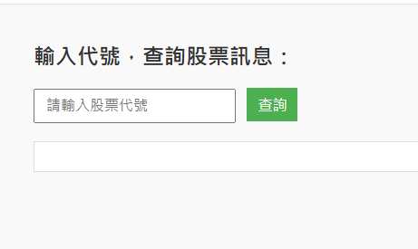

⭐股票查詢side project

簡介:

這是一支股票資料查詢程式,只要輸入台灣股票代號,就能將查詢的資料透過API儲存成json檔,並透過整合前端來將查詢結果作呈現

功能使用說明:

User 輸入股票代號 (例:2330 ,就可以查詢到台積電)
透過程式爬取Yahoo股市的資料來找到輸入代號的股票
將結果以API的方式回傳成json檔
接著透過HTML及JS即時呈現
另外,也有基本的錯誤提示訊息

✔️python 3.12
✔️Flask
✔️Requests
✔️BeautifulSoup
✔️json
✔️HTML/JavaScript

專案結構:

interview_project

        ├─ app.py (主程式)

        ├─ GetStock.py (主要應用模組)

        ├─ GetStockjson.py (把模組查詢的資料存成json)

        ├─ README.md (程式簡介)

        ├─ templates

        │      └─ index.html (前端首頁)

        │
        
        └─screenshot (畫面截圖 for README)

使用方法:

( Git Clone用網址 https://github.com/Frank-Pon/Interview_project.git ) clone之後 -> 安裝所需套件 ( Flask、Requests、BeautifulSoup )
-> 在終端機輸入 python app.py -> 打開網頁輸入 127.0.0.1:5000 -> 開始查詢 ✅

專案學習心得:

這是我的第一支獨立完成的 side project

在上完職訓轉職進公司之後就有獨立寫過一支程式

內容包含API、資料庫、xml樹狀資料封包傳輸,還有這支程式所有的技術

那時對程式並不熟練,而且公司也沒有人會寫程式

我只能一直查資料、問朋友還有ChatGPT,

使用了一些土法煉鋼的方法,勉強架好了一個能夠把客戶的訂單傳送出去的網站

但我很清楚這項是一棟岌岌可危的危樓

如果基本功不夠穩,又沉浸在「寫好一個複雜系統」的虛榮感裡的話

那麼我就沒辦法進步,也沒辦法寫出更有架構、可讀性更好的程式

這次選擇重新從零開始做這個 side project

除了想要更穩扎穩打的練基本功之外

也是不想讓自己「這樣就好」

但我也知道，這只是開始。

程式語言是一門非常有趣也值得深耕的領域

所以我會繼續探索,增加自己的經驗及技術

不只強化後端能力，未來也想學習前端，拓展自己的視野，讓自己走得更穩、更遠。

職訓完剛進公司的作品:

以上這張截圖是我剛進公司時土法煉鋼寫出來的第一份系統

功能是查詢比對ERP（Oracle）與 MES（MSSQL）的資料,比對上的列出表格

並可以儲存成Excel及傳輸至客戶的NetSuite系統

